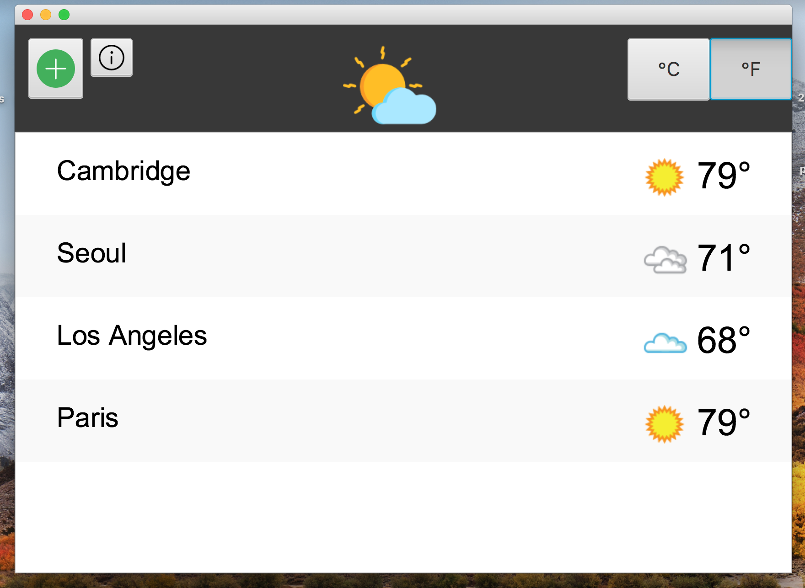
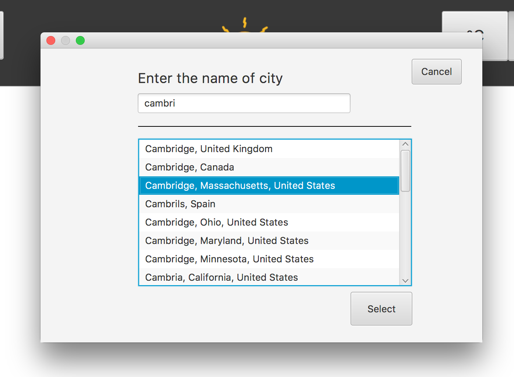
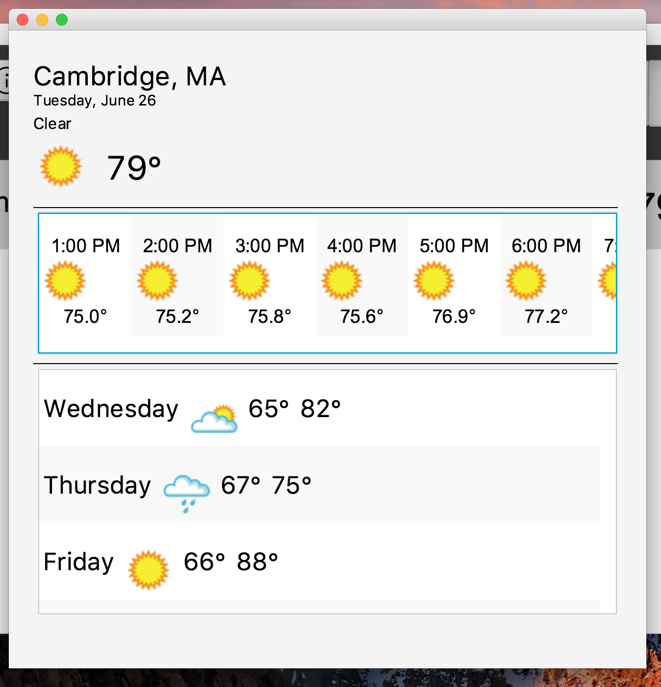

# Weather App Built by Java and JavaFX

## What it does: 

You can search the weathers of cities in the world through wunderground.com API.

## Technique:

Java and JavaFX in Netbeans Platform

The use of API from www.wunderground.com 

## Requirement: 

Need to have Java SE Runtime Environment in order to run this program

Please download and go to dist directory to run the application

If you are in dist directory,  
please run "WeatherApp_Final.jar" or
type `java -jar WeatherApp_Final.jar` in your terminal/cmd

You can read my java code in src directory.

# Screenshots

